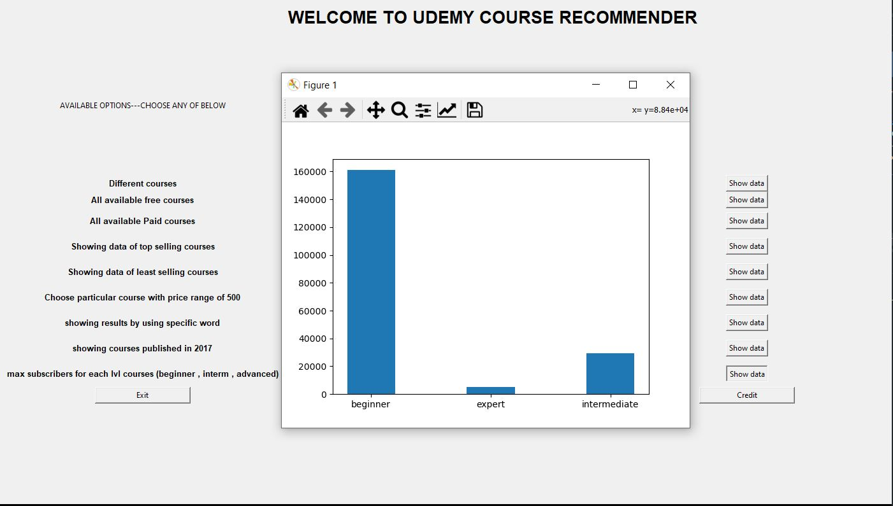

# Udemy-Course-Recommender-DataScience-Project-
<h1>Requirements</h1> 
 : Pandas , Matplotlib , rich text , tableprint ,Tkinter

<h1>How to use it ??</h1>

There are 2 versions (1)GUI (2)CLI , you have to connect [.csv] file in the python code (both CLI and GUI) to make it work , by extracting data from it's rows and columns it can do analysis

We have already provided several options inside the both of the code from which any user can choose any option

<h1>CLI IMGAGES</h1>

<h1>GUI IMGAGES</h1>

